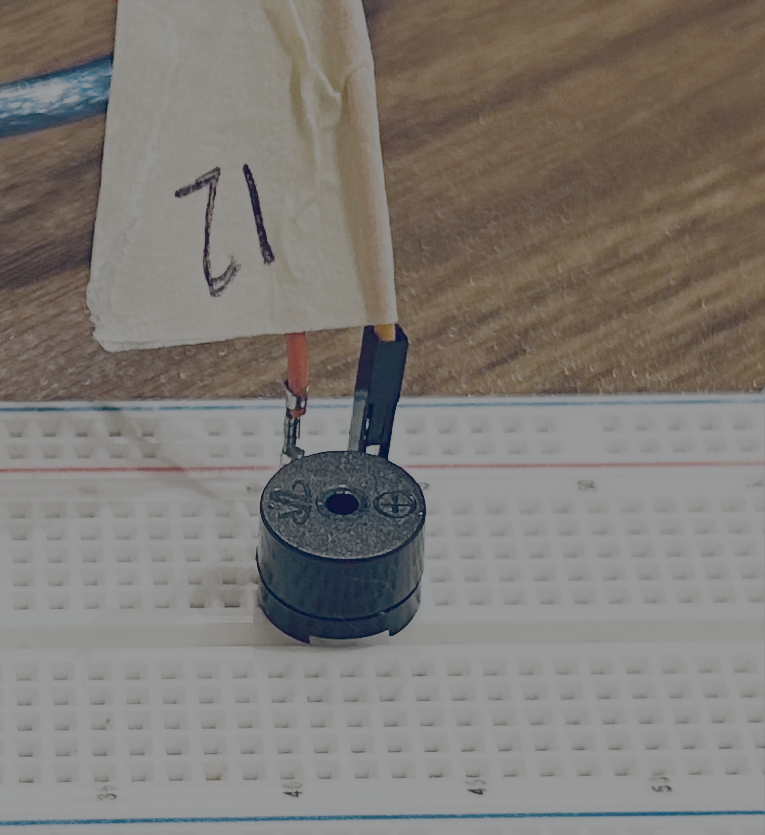

# ElectroBlocks Examples

This repo is a list of ElectroBlocks Component Examples in Python and C.

## Setup

```bash
python -m venv .venv
source .venv/bin/activate
pip install -r requirements.txt
```

## Digital Display

### Project File

[Project File](./digital_display/project.xml)

### Example Video


### [Python Code](./digital_display/python_code.py)

```python
#Import ElectroBlocks library
from electroblocks import ElectroBlocks
import time # imports the time library

# Initialise the program settings and configurations
eb = ElectroBlocks() # Create an instance of the ElectroBlocks class
eb.config_digital_display(11, 10)

while True:
  eb.set_digital_display(True, "Toot")
  time.sleep(1) # Wait for the given/defined seconds.
  eb.set_digital_display(False, "Loon")
  time.sleep(1) # Wait for the given/defined seconds.
```

### [C Code](./digital_display/c_code.ino)
```c
#include <TM1637.h>  // Includes the library for the TM1637 7-segment display
const byte PIN_CLK = 10;   // Defines CLK pin for the display
const byte PIN_DIO = 11;   // Defines DIO pin for the display
// Initializes the 7-segment display with CLK and DIO pins
TM1637    tm(PIN_CLK, PIN_DIO);


// Initialise the program settings and configurations
void setup() {
  tm.begin();
  tm.setBrightness(100);
  tm.clearScreen();

}

// The void loop function runs over and over again forever.
void loop() {

  tm.clearScreen();
  tm.colonOn();
  tm.display(String("Toot"));
  delay(1000); // Wait for the given/defined milliseconds.

  tm.clearScreen();
  tm.colonOff();
  tm.display(String("Loon"));
  delay(1000); // Wait for the given/defined milliseconds.
}

```

## NeoPixels / FastLED / LED Strip

### Project File

[Project File](./fast_led/project.xml)

### [Example of C code](./fast_led/c_code.ino)


```c
struct RGB {
    double red;
    double green;
    double blue;
};

#include <FastLED.h>  // Includes the FastLED library for controlling LED strips
#define NUM_LEDS 30 // Defines the number of LEDs in the strip
#define DATA_PIN A0 // Creates an array to hold the LED colors
CRGB leds[NUM_LEDS]; // Creates an array to hold the LED colors


double i = 0;


// Initialise the program settings and configurations
void setup() {

   // Initializes the LED strip
   FastLED.addLeds<WS2811, DATA_PIN, GRB>(leds, NUM_LEDS);
   // Sets the brightness of the LEDs
   FastLED.setBrightness(10);

}

// The void loop function runs over and over again forever.
void loop() {
  // Set all Colors for led strip
  setFastLEDColor(1,{255, 8, 206});
  setFastLEDColor(2,{0, 0, 0});
  setFastLEDColor(3,{0, 0, 0});
  setFastLEDColor(4,{0, 0, 0});
  setFastLEDColor(5,{0, 0, 0});
  setFastLEDColor(6,{0, 0, 0});
  setFastLEDColor(7,{0, 0, 0});
  setFastLEDColor(8,{0, 0, 0});
  setFastLEDColor(9,{0, 0, 0});
  setFastLEDColor(10,{0, 0, 0});
  setFastLEDColor(11,{0, 0, 0});
  setFastLEDColor(12,{237, 0, 162});
  setFastLEDColor(13,{0, 0, 0});
  setFastLEDColor(14,{0, 0, 0});
  setFastLEDColor(15,{0, 0, 0});
  setFastLEDColor(16,{0, 0, 0});
  setFastLEDColor(17,{0, 0, 0});
  setFastLEDColor(18,{0, 0, 0});
  setFastLEDColor(19,{0, 0, 0});
  setFastLEDColor(20,{0, 0, 0});
  setFastLEDColor(21,{0, 0, 0});
  setFastLEDColor(22,{0, 0, 0});
  setFastLEDColor(23,{0, 0, 0});
  setFastLEDColor(24,{0, 0, 0});
  setFastLEDColor(25,{252, 42, 5});
  setFastLEDColor(26,{0, 0, 0});
  setFastLEDColor(27,{0, 0, 0});
  setFastLEDColor(28,{0, 0, 0});
  setFastLEDColor(29,{0, 0, 0});
  setFastLEDColor(30,{255, 51, 0});
  // End of setting all the colors for the led strip.

  FastLED.show(); // Sets the color the led strip.
  delay(2000); // Wait for the given/defined milliseconds.
  for (i = 1; i <= 30; i += 1) {
    setFastLEDColor(i,{ 255, 0, 255});

  }
  FastLED.show(); // Sets the color the led strip.
  delay(2000); // Wait for the given/defined milliseconds.
}


// Sets the color of a specific LED at the given position
void setFastLEDColor(int pos, struct RGB color) {
    pos = pos <= 0 ? 0 : pos; // Ensures the position is not negative
    pos = pos >= 1 ? pos - 1 : pos;  // Adjusts position to fit within the array bounds
    leds[pos].setRGB((int)color.red, (int)color.green, (int)color.blue); // Sets the LED color
}

```

### [Example of Python Code](./fast_led/python_code.py)

Notice that it runs slower because of the loop where it has to send each command to set the individual colors from the laptop / computer running python.


```python
#Import ElectroBlocks library
from electroblocks import ElectroBlocks
import time # imports the time library


from dataclasses import dataclass

@dataclass
class RGB:
  red: float
  green: float
  blue: float


# Variable Declaration
i = 0


# Initialise the program settings and configurations
eb = ElectroBlocks() # Create an instance of the ElectroBlocks class
eb.config_rgb_strip("A0", 30, "GRB", 10) # Configures the NEOPIXEL strip


while True:
  eb.rgb_strip_set_all_colors([
  	(255, 8, 206),(0, 0, 0),(0, 0, 0),
  	(0, 0, 0),(0, 0, 0),(0, 0, 0),
  	(0, 0, 0),(0, 0, 0),(0, 0, 0),
  	(0, 0, 0),(0, 0, 0),(237, 0, 162),
  	(0, 0, 0),(0, 0, 0),(0, 0, 0),
  	(0, 0, 0),(0, 0, 0),(0, 0, 0),
  	(0, 0, 0),(0, 0, 0),(0, 0, 0),
  	(0, 0, 0),(0, 0, 0),(0, 0, 0),
  	(252, 42, 5),(0, 0, 0),(0, 0, 0),
  	(0, 0, 0),(0, 0, 0),(255, 51, 0)
  ])
  eb.rgb_strip_show_all() # Sets the color the led strip.
  time.sleep(2) # Wait for the given/defined seconds.
  for i in range(1, 31, 1):
    developer_temp_color = RGB(255, 0, 255) # create a variable to store the color
    eb.rgb_strip_set_color(i, developer_temp_color.red, developer_temp_color.green, developer_temp_color.blue)
  eb.rgb_strip_show_all() # Sets the color the led strip.
  time.sleep(2) # Wait for the given/defined seconds.

```

## LCD Screen

### Project File

[Project File](./lcd/project.xml)

### Example Video


### Python Code

```python
#Import ElectroBlocks library
from electroblocks import ElectroBlocks
import time # imports the time library


# Initialise the program settings and configurations
eb = ElectroBlocks() # Create an instance of the ElectroBlocks class
eb.config_lcd(4, 20, 63) # Configures the LCD Screen pins


while True:
  eb.lcd_clear() #clear screen
  eb.lcd_print(0, 0, "Hello") # Print the first row text on the LCD screen
  eb.lcd_print(1, 0, "  World") # Print the second row text on the LCD screen
  eb.lcd_print(2, 0, " Test") # Print the third row text on the LCD screen
  eb.lcd_print(3, 0, " .# moo #- ") # Print the fourth row text on the LCD screen
  time.sleep(3) # Wait for 3 seconds
  eb.lcd_clear() # clear screen
  time.sleep(0.2) # Wait for the given/defined seconds.
  eb.lcd_print(0, 0, "Hi") # Print a message on the LCD screen at specified row and column
  for i in range(1, 18 + 1):
    eb.lcd_scrollright()
    time.sleep(0.2) # Wait for the given/defined seconds.
  for i2 in range(1, 18 + 1):
    eb.lcd_scrollleft()
    time.sleep(0.2) # Wait for the given/defined seconds.
  eb.lcd_clear() # Clear the LCD screen
  eb.lcd_blink_curor(3, 9, True) # Turn on the blink.
  time.sleep(1) # Wait for the given/defined seconds.
  eb.lcd_blink_curor(3, 9, False) # Turn off the blink.
  time.sleep(1) # Wait for the given/defined seconds.
  eb.lcd_toggle_backlight(False) # Turn off the LCD backlight
  time.sleep(1) # Wait for the given/defined seconds.
  eb.lcd_toggle_backlight(True) # Turn on the LCD backlight
  time.sleep(1) # Wait for the given/defined seconds.
```

### C Code

```c
#include <Wire.h>;  // Include the Wire library for I2C communication.
#include <LiquidCrystal_I2C.h>;  // Include the LiquidCrystal_I2C library for controlling the LCD
LiquidCrystal_I2C lcd(0X3F,4,20); // Create an LCD object with I2C address 0X3F, 4 rows, and 20 columns
int simple_loop_variable = 0;


// Initialise the program settings and configurations
void setup() {
   lcd.init(); // Initialize the LCD
   lcd.backlight(); // Turn on the LCD backlight

}

// The void loop function runs over and over again forever.
void loop() {
  lcd.clear(); // Clear LCD Screen
  lcd.setCursor(0, 0); // Print a message on the LCD screen
  lcd.print(String("Hello")); // Prints a message on LCD Screen.
  lcd.setCursor(0, 1); // Print a message on the LCD screen
  lcd.print(String("  World")); // Prints a message on LCD Screen.
  lcd.setCursor(0, 2); // Print a message on the LCD screen
  lcd.print(String(" Test")); // Prints a message on LCD Screen.
  lcd.setCursor(0, 3); // Print a message on the LCD screen
  lcd.print(String(" .# moo #- ")); // Prints a message on LCD Screen.
  delay(3000); // Wait 3 seconds
  lcd.clear(); // Clear LCD Screen

  delay(200); // Wait for the given/defined milliseconds.
  lcd.setCursor(0, 0); // Set position to print on the LCD screen
  lcd.print(String("Hi")); // Print a message on the LCD screen
  for (simple_loop_variable = 1; simple_loop_variable <= 18; simple_loop_variable += 1) {
    lcd.scrollDisplayRight();
    delay(200); // Wait for the given/defined milliseconds.
  }
  for (simple_loop_variable = 1; simple_loop_variable <= 18; simple_loop_variable += 1) {
    lcd.scrollDisplayLeft();
    delay(200); // Wait for the given/defined milliseconds.
  }
  lcd.clear(); // Clear LCD Screen.
  lcd.setCursor(9, 3);
  lcd.blink();
  delay(1000); // Wait for the given/defined milliseconds.
  lcd.setCursor(9, 3);
  lcd.noBlink();
  delay(1000); // Wait for the given/defined milliseconds.
  lcd.noBacklight(); // Turn off backlight
  delay(1000); // Wait for the given/defined milliseconds.
  lcd.backlight(); // Turn on backlight
  delay(1000); // Wait for the given/defined milliseconds.
}
```

## LED 

### Project File

[Project File](./led/project.xml)

### Example Video


### Python

```python
#Import ElectroBlocks library
from electroblocks import ElectroBlocks
import time # imports the time library


# Variable Declaration
i = 0


# Initialise the program settings and configurations
eb = ElectroBlocks() # Create an instance of the ElectroBlocks class
eb.digital_write_config(8)
eb.analog_write_config(9)


while True:
  eb.digital_write(8, 1) # Turns the led on
  time.sleep(1) # Wait for the given/defined seconds.
  eb.digital_write(8, 0) # Turns the led off
  time.sleep(1) # Wait for the given/defined seconds.
  for i in range(0, 101, 5):
    eb.analog_write(9, i)
    time.sleep(0.1) # Wait for the given/defined seconds.
  for i in range(100, -1, -5):
    eb.analog_write(9, i)
    time.sleep(0.1) # Wait for the given/defined seconds.
  time.sleep(1) # Wait for the given/defined seconds.
```

### C Code

```c

double i = 0;


// Initialise the program settings and configurations
void setup() {
   pinMode(8, OUTPUT);  // Configures led pin as an output
   pinMode(9, OUTPUT); // Configures led pin as an output

}

// The void loop function runs over and over again forever.
void loop() {
  digitalWrite(8, HIGH); // Set defined pin to HIGH (turn it on).
  delay(1000); // Wait for the given/defined milliseconds.
  digitalWrite(8, LOW); // Set defined pin to LOW (turn it off).
  delay(1000); // Wait for the given/defined milliseconds.
  for (i = 0; i <= 100; i += 5) {
    analogWrite(9, i);
    delay(100); // Wait for the given/defined milliseconds.

  }
  for (i = 100; i >= 0; i -= 5) {
    analogWrite(9, i);
    delay(100); // Wait for the given/defined milliseconds.

  }
  delay(1000); // Wait for the given/defined milliseconds.
}
```

## LED Matrix

### Project File

[Project File](./led_matrix/project.xml)

### Example Video


### Python Code

```python
#Import ElectroBlocks library
from electroblocks import ElectroBlocks
import time # imports the time library


# Variable Declaration
i = 0


# Initialise the program settings and configurations
eb = ElectroBlocks() # Create an instance of the ElectroBlocks class


eb.config_led_matrix(10,11,12, True)

while True:
  for i in range(1, 3 + 1):

    eb.draw_led_matrix([
    	"b00000000",
    	"b01100110",
    	"b01100110",
    	"b00000000",
    	"b00011000",
    	"b00000000",
    	"b10001111",
    	"b00111100",
    ])

    time.sleep(0.2) # Wait for the given/defined seconds.

    eb.draw_led_matrix([
    	"b00000000",
    	"b01100000",
    	"b01100110",
    	"b00000000",
    	"b00011000",
    	"b00000000",
    	"b11110001",
    	"b00111100",
    ])

    time.sleep(0.2) # Wait for the given/defined seconds.

  eb.draw_led_matrix([
  	"b00000000",
  	"b00000000",
  	"b00000000",
  	"b00000000",
  	"b00000000",
  	"b00000000",
  	"b00000000",
  	"b00000000",
  ])

  for i in range(1, 9, 1):
    eb.set_led_matrix_led(i, i, True)
    time.sleep(0.1) # Wait for the given/defined seconds.
  for i in range(8, 0, -1):
    eb.set_led_matrix_led(i, i, False)
    time.sleep(0.1) # Wait for the given/defined seconds.
  time.sleep(1) # Wait for the given/defined seconds.
```

### C Code

```c
// This a wrapper library on LedControl that allows us to rotate for breadboards
#include "LedMatrix.h";

LedMatrix lm(10, 12, 11, LedMatrix::R0, true);
byte developer_ledmatrix_image[8] = {
    B00000000,
    B00000000,
    B00000000,
    B00000000,
    B00000000,
    B00000000,
    B00000000,
    B00000000
};
int simple_loop_variable = 0;

double i = 0;


// Initialise the program settings and configurations
void setup() {

}

// The void loop function runs over and over again forever.
void loop() {
  for (simple_loop_variable = 1; simple_loop_variable <= 3; simple_loop_variable += 1) {

    developer_ledmatrix_image[0] = B00000000;
    developer_ledmatrix_image[1] = B01100110;
    developer_ledmatrix_image[2] = B01100110;
    developer_ledmatrix_image[3] = B00000000;
    developer_ledmatrix_image[4] = B00011000;
    developer_ledmatrix_image[5] = B00000000;
    developer_ledmatrix_image[6] = B10001111;
    developer_ledmatrix_image[7] = B00111100;
    lm.setImage(developer_ledmatrix_image); // Turns on the leds

    delay(200); // Wait for the given/defined milliseconds.

    developer_ledmatrix_image[0] = B00000000;
    developer_ledmatrix_image[1] = B01100000;
    developer_ledmatrix_image[2] = B01100110;
    developer_ledmatrix_image[3] = B00000000;
    developer_ledmatrix_image[4] = B00011000;
    developer_ledmatrix_image[5] = B00000000;
    developer_ledmatrix_image[6] = B11110001;
    developer_ledmatrix_image[7] = B00111100;
    lm.setImage(developer_ledmatrix_image); // Turns on the leds

    delay(200); // Wait for the given/defined milliseconds.
  }

  developer_ledmatrix_image[0] = B00000000;
  developer_ledmatrix_image[1] = B00000000;
  developer_ledmatrix_image[2] = B00000000;
  developer_ledmatrix_image[3] = B00000000;
  developer_ledmatrix_image[4] = B00000000;
  developer_ledmatrix_image[5] = B00000000;
  developer_ledmatrix_image[6] = B00000000;
  developer_ledmatrix_image[7] = B00000000;
  lm.setImage(developer_ledmatrix_image); // Turns on the leds

  for (i = 1; i <= 8; i += 1) {

    lm.setPixel(i, i, true); // change one pixel in the buffer.
    lm.setImage(); // changes the pixels on the device

    delay(100); // Wait for the given/defined milliseconds.

  }
  for (i = 8; i >= 1; i -= 1) {

    lm.setPixel(i, i, false); // change one pixel in the buffer.
    lm.setImage(); // changes the pixels on the device

    delay(100); // Wait for the given/defined milliseconds.

  }
  delay(1000); // Wait for the given/defined milliseconds.
}
```

## Motor

I had to use the 12 V pin on the L298 board to get the DC motors spinning when powered by a 9 V battery.

### Project File

[Project File](./motor/project.xml)

### Example Video


### Python Code

```python
#Import ElectroBlocks library
from electroblocks import ElectroBlocks
import time # imports the time library


# Initialise the program settings and configurations
eb = ElectroBlocks() # Create an instance of the ElectroBlocks class
eb.config_motor(9, 8, 7, 3, 5, 4)


while True:
  eb.move_motor(1, 150, "clockwise")
  time.sleep(3) # Wait for the given/defined seconds.
  eb.stop_motor(1)
  time.sleep(3) # Wait for the given/defined seconds.
  eb.move_motor(1, 150, "anti_clockwise")
  time.sleep(3) # Wait for the given/defined seconds.
  eb.stop_motor(1)
  time.sleep(3) # Wait for the given/defined seconds.
  eb.move_motor(2, 150, "clockwise")
  time.sleep(3) # Wait for the given/defined seconds.
  eb.stop_motor(2)
  time.sleep(3) # Wait for the given/defined seconds.
  eb.move_motor(2, 150, "anti_clockwise")
  time.sleep(3) # Wait for the given/defined seconds.
  eb.stop_motor(2)
  time.sleep(3) # Wait for the given/defined seconds.

```

### C Code

```c

// Define an enumeration for motor direction with three possible values
typedef enum {
  CLOCKWISE = 0, // Motor turns in the clockwise direction
  ANTI_CLOCKWISE = 1,  // Motor turns in the anti-clockwise direction
  STOP = -1 // Motor stops
} Direction;

// Pin assign for the motor control
const int motor1Pin1 = 8;  // Control pin for motor direction 1
const int motor1Pin2 = 7;  // Control pin for motor direction 2
const int enablePin1 = 9; // PWM pin to enable the motor1
const int motor2Pin1 = 5; // Control pin for motor2 direction 1
const int motor2Pin2 = 4; // Control pin for motor2 direction 2
const int enablePin2 = 3; // PWM pin to enable the motor2

// Function to move the motor based on specified speed and direction
void moveMotor(int motor, int speed, Direction direction) {
  int enablePin = motor == 1 ? enablePin1 : enablePin2; // Set the enable pin to enablePin1
  int pin1 = motor == 1 ? motor1Pin1 : motor2Pin1; // Set pin1 to control direction 1
  int pin2 = motor == 1 ? motor1Pin2 : motor2Pin2; // Set pin2 to control direction 2
  // Control the motor direction based on the specified direction
  if (speed > 255) {
    speed = 254;
  } else if (speed < 1) {
    speed = 1;
  }

  switch (direction) {
    case CLOCKWISE:
      digitalWrite(pin1, HIGH);  // Set pin1 high to turn clockwise
      digitalWrite(pin2, LOW); // Set pin2 low
      analogWrite(enablePin, speed);  // Set motor speed
      break;
    case ANTI_CLOCKWISE:
      digitalWrite(pin1, LOW); // Set pin1 low to turn anti-clockwise
      digitalWrite(pin2, HIGH); // Set pin2 high
      analogWrite(enablePin, speed); // Set motor speed
      break;
    case STOP:
      analogWrite(enablePin, 0);  // Stop the motor
      break;
  }
}


// Initialise the program settings and configurations
void setup() {

   // Configuring motor control pins
   pinMode(motor1Pin1, OUTPUT); // Set motor1Pin1 as output
   pinMode(motor1Pin2, OUTPUT); // Set motor1Pin2 as output
   pinMode(enablePin1, OUTPUT); // Set enablePin1 as output
   pinMode(motor2Pin1, OUTPUT); // Set motor2Pin1 as output
   pinMode(motor2Pin2, OUTPUT); // Set motor2Pin2 as output
   pinMode(enablePin2, OUTPUT); // Set enablePin2 as output
   // Motor pin setup complete

}

// The void loop function runs over and over again forever.
void loop() {
  moveMotor(1, 150, CLOCKWISE);
  delay(3000); // Wait for the given/defined milliseconds.
  moveMotor(1, 0, STOP);
  delay(3000); // Wait for the given/defined milliseconds.
  moveMotor(1, 150, ANTI_CLOCKWISE);
  delay(3000); // Wait for the given/defined milliseconds.
  moveMotor(1, 0, STOP);
  delay(3000); // Wait for the given/defined milliseconds.
  moveMotor(2, 150, CLOCKWISE);
  delay(3000); // Wait for the given/defined milliseconds.
  moveMotor(2, 0, STOP);
  delay(3000); // Wait for the given/defined milliseconds.
  moveMotor(2, 150, ANTI_CLOCKWISE);
  delay(3000); // Wait for the given/defined milliseconds.
  moveMotor(2, 0, STOP);
  delay(3000); // Wait for the given/defined milliseconds.
}

```


## Passive Buzzer

### Project File

[Project File](./passive_buzzer/project.xml)

### Example Video



<audio controls>
  <source src="./passive_buzzer/buzzer.m4a" type="audio/m4a">
</audio>

### Python Code

```python
#Import ElectroBlocks library
from electroblocks import ElectroBlocks
import time # imports the time library


# Variable Declaration
i = 0


# Initialise the program settings and configurations
eb = ElectroBlocks() # Create an instance of the ElectroBlocks class
eb.config_passive_buzzer(9)


while True:
  eb.play_passive_buzzer(9, 131)
  time.sleep(0.2) # Wait for the given/defined seconds.
  for i in range(100, 401, 10):
    eb.play_passive_buzzer(9, i)
    time.sleep(0.2) # Wait for the given/defined seconds.
  eb.play_passive_buzzer(9, 0)
  time.sleep(2) # Wait for the given/defined seconds.
  eb.play_passive_buzzer(9, 10000)
  time.sleep(2) # Wait for the given/defined seconds.

```

### C Code

```c

double i = 0;


// Initialise the program settings and configurations
void setup() {
	pinMode(9, OUTPUT);

}

// The void loop function runs over and over again forever.
void loop() {
  tone(9, 131);
  delay(200); // Wait for the given/defined milliseconds.
  for (i = 100; i <= 400; i += 10) {
    tone(9, i);
    delay(200); // Wait for the given/defined milliseconds.

  }
  noTone(9);
  delay(2000); // Wait for the given/defined milliseconds.
  tone(9, 10000);
  delay(2000); // Wait for the given/defined milliseconds.
}

```

## Passive Buzzer

### Project File

[Project File](./lcd/project.xml)

### Example Video


### Python Code

```python

```

### C Code

```c

```